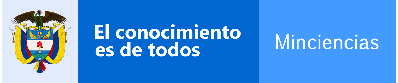

# CDSLib - Agents

Welcome to **CDSLib - Agents** package.

## License

## Sponsors

|  |  |  |
| :---: | :---: | :---: |
|  |  |  |

## Code quality metrics

## Description

As part of the **Contagious Disease Simulation Library**, the
**CDSLib - Agents** package is intended to be used for modelling and simulating
contagious diseases using Agent-Based Models and it has been used for the development
of the [Contagious Disease Simulation Laboratory](https://github.com/fenfisdi/cdslab).

The package consists of different implementations of a heterogeneous population
of agents following rules of behavior that determine their movement and the evolution
of their infectious and clinical states.

The current implementation allows Agents to move in a bidemensional space following
a distribution of velocities based on population data. This can be achieved thanks to
the inclusion Distribution module which is a wrapper for different tools that provides
distribution-like function support.

In regards to the disease states, the current implementation also allows the user to
add as much states as preferred, and to create custom natural history of the disease
(i.e. the design a custom graph for evolution of disease states).

For more information, please refer to the official documentation of the project.

## Main contributors

This package was made with thanks to the leadership of
[Camilo Hincapié](https://www.linkedin.com/in/camilo-hincapie-gutierrez/)
and the contributions of
[Ian Mejía](https://github.com/IanMejia),
[Carolina Rojas Duque](https://github.com/carolinarojasd),
[Emil Rueda](https://www.linkedin.com/in/emil-rueda-424012207/),
[Nicole Rivera](https://github.com/nicolerivera1) and
[Alejandro Campillo](https://www.linkedin.com/in/alucardcampillo/).

## Contact us

For any suggestion on the development of this type of models, please our official
channels of [dicussions](https://github.com/fenfisdi/cdslib_agents/discussions)
provided by GitHub.