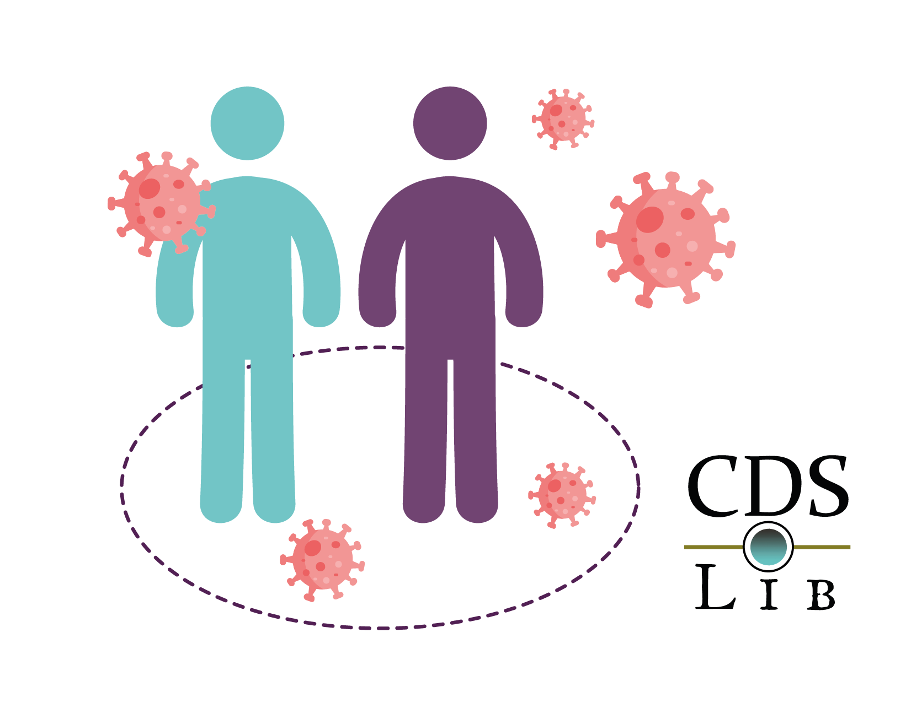

# CDSLib - Agents

Welcome to the Agent Based Model of the Contagious Disease Simulation Library

## Description

The model consists of a heterogeneous population of agents following rules of behavior that determine their movement and the evolution of their infectious and clinical states.

Agents are able to move in a bidemensional space following a distribution of velocities based on population data. Every agent is in one out of many infective and clinical states set by the user, they may be as simple as susceptible, infected and recovered or, more states may be added according to user specification i.e. hospitalized, severe, latent, etc.

## Features

### Agent heterogeneity

Agents represent a population of individuals with different age and comorbidity

### Agent motion and velocity
The initial position of agents in space is randomly distributed. Initial velocity is set according to a distribution of velocities based on population data. In every time step, agent velocity changes according to a function that assigns high probability to velocities neighboring initial velocity 

### Clinical states

## Running the model

## Deployment

## Contributors

We want to give special thanks to Camilo Hincapié and Lina Ruiz who has been working on this model continuously. Partial results has been presented in the Americans' Network for Chronic Disease Surveillance (AMNET)

## License (?)
